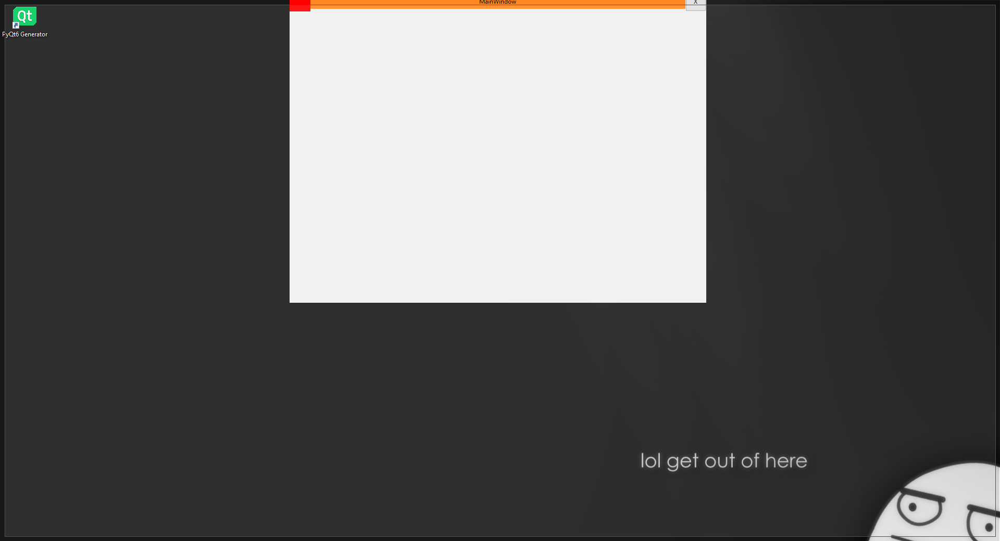

# QAeroSnap: 1.0.0

Windows 10 **AeroSnap** for **PyQt6**

This application is currently under development, and new features will soon be available...

#### Information:
- Work just on the top of the screen
- Multi Monitor compatibility

## API Reference

#### Import

```
  >>> from QAeroSnap import QtAeroSnap
```

#### Usage

```
  >>> QtAeroSnap({mainwindow}, {titlebar}, {x_adjustment}, {y_adjustment})
```

| Parameter     | Type                      | Description                       |
| :--------     | :-------                  | :-------------------------------- |
| `mainwindow`  | `QtWidgets.QMainWindow`   | **Required**. MainWindow          |
| `titlebar`    | `QtWidgets.QWidget`       | **Required**. Custom Title Bar    |
| `x_adjustment`| `int`                     | **Optional**. X Adjustment (spacing on layout etc.)|
| `Y_adjustment`| `int`                     | **Optional**. Y Adjustment (spacing on layout etc.)|

## Installation

Git clone

```bash
  git clone 'https://github.com/DuraItsMe/QAeroSnap'
```

Pip install dependencies

```bash
  cd ..\QAeroSnap\
  pip install .
```
## Color Reference

| Color             | rgba                                                                |
| ----------------- | ----------------------- |
| Background        | (255, 255, 255, 12) |
| Border            | (156, 156, 156, 128)|


## Screenshots




## Author

- [@DuraItsMe](https://github.com/DuraItsMe)

